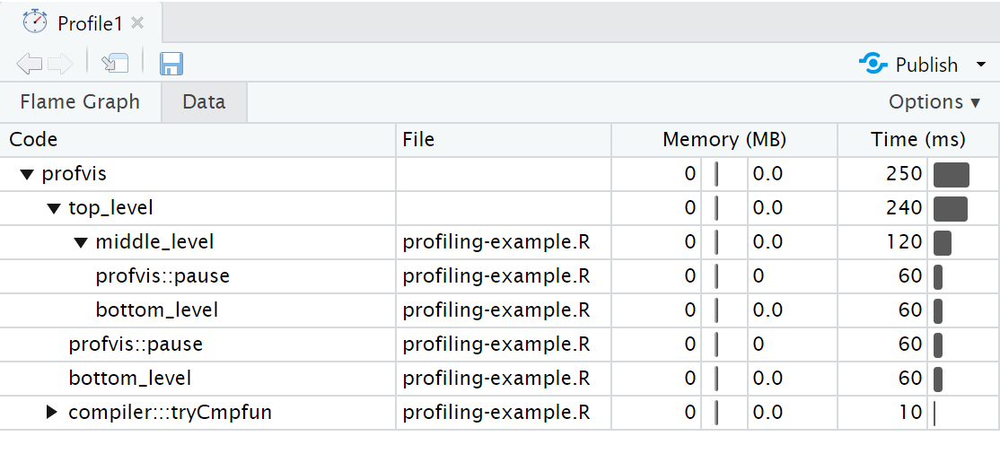

```{r setup, include=FALSE}
options(digits = 4)
options(width = 67)
library(knitr)
library(kableExtra)
opts_chunk$set(echo = TRUE, dev = "png", dpi = 300,
               comment = "#", eval = TRUE, 
               fig.width = 5, fig.height = 5, 
               knitr.table.format = "markdown")
# trim white space top and right of plot
knit_hooks$set(small.mar = function(before, options, envir) {
    if (before) par(mar = c(4, 5, 2, 1))
})
# trim white space when par won't work
library(magick)
knit_hooks$set(crop = function(before, options, envir) {
    if (before || isTRUE((fig.num <- options$fig.num) == 0L))
        return()
    paths = fig_path(options$fig.ext, options, fig.num)
    for (f in paths) image_write(image_trim(image_read(f)), f)
})
# function to put ``` when compiling Rmd
ticks <- function() "```"
set.seed(1)
```

layout: true

.footer[`r fontawesome::fa("link")` &nbsp; [hturner.github.io/IISA2022](https://hturner.github.io/IISA2022)]

---

class: inverse middle

# Memory management

---

# Overview

Objects created in R are stored in memory. This has the advantage that
objects can be accessed faster, but R slows down as the memory fills up.
Creating objects also takes time. 

Therefore:

--
* Re-use temporary variables. The allocated storage will be re-used if
the vector has the same length.

--
* Save results for re-use, e.g. index variables

--
* Don't save intermediate results unnecessarily -- compute on-the-fly

--
* Remove large objects when no longer needed (with `rm()`)
 
---

# Basic data structures

Try to use the simplest data structure for your purpose
 - matrices vs. data frames 
 - character or integer vectors vs. factors
 - logical or integer vectors vs. numeric vectors
 - unnamed objects vs. named objects

--

It is especially important to use low-level structures for computation

You can create richer objects as a final step before returning to the user.

???
L for integer

---

# Big Data

Modern computers have enough RAM to work with millions of records 
using standard functions.

Some packages to work more efficiently with big data:

 - **data.table** faster operations on data frames; read/write 
large CSVs
 - **dplyr** + **dbplyr** processing of data in databases.
 - **arrow** read/write large CSVs or binary files e.g. Parquet; processing larger-than-memory data with **dplyr** commands.
 - **bigmemory**, **biganalytics** faster matrix operations,
generalized linear models, kmeans

???
N.B. sparse matrices not as efficient as you might expect for general programming, may need big data for it to be important.

Parallelisation can also help, see later [no longer covered in this section]

---

# Growing Objects

Adding to an object in a loop

```{r adding}
res <- NULL
for (i in 1:5000) res <- c(res, 1)
``` 
   
may force a copy to be made at each iteration, with each copy stored until the
loop has completed. 

--
   
It is far better to create an object of the necessary size first  

```{r empty.object}
res <- numeric(5000)
for (i in seq_along(res)) res[i] <- 1
```

---

# Copy-on-Change

R usually copies an object to make changes to it.

`tracemem` can be used to trace copies of an object

```{r trace.growing}
z <- NULL
for (i in 1:3){ z <- c(z,1); print(tracemem(z)) }
```
--
```{r trace.growing2}
z <- numeric(2); print(tracemem(z))
```

```{r trace.growing3}
for (i in 1:2){z[i] <- i;print(tracemem(z))}
``` 

???

makes copy for each separate block of code
e.g. if run with above in one go interactively no copies
     if run in separate chunks 1 copy
     
---

class: inverse middle

# Benchmarking

---

# Benchmarking

There will usually be many ways to write code for a given task. To compare
alternatives, we can use benchmark the code.

If the code is more than a single expression, create wrappers for each alternative
```{r benchmark-alternatives, eval = TRUE}
grow <- function(n){
  res <- NULL
  for (i in 1:n) res <- c(res, 1)
  res
}
pre_specify <- function(n){
  res <- numeric(n)
  for (i in seq_along(res)) res[i] <- 1
  res
}
``` 
---

# `bench::mark`

Run the two alternatives with `bench::mark`. This function 
 - Runs alternatives &ge; 1 time; at most enough times to take 0.5s
 - Makes sure the two expressions return the same result!  
 
--
```{r benchmark, eval = TRUE}
library(bench)
(bm <- bench::mark(grow(5000), pre_specify(5000)))
```

* `GC` is the garbage collector which tidies up deleted objects
* `itr/sec` is how many times the expression could be run in 1s

---

# Plotting benchmarks

Distribution tends to be right-skewed - focus on the median!


```{r, fig.align = "center", fig.height = 3, out.width = "75%"}
plot(bm)
```

---

# Scaling

Benchmarking can be difficult as the best option can depend on the size of the data, e.g. memory allocation can overshadow run time for small objects.

When thinking about how our code scales to bigger, we need to consider what we mean by "big"

--
 - number of rows or number of columns?

--
 - number of observations or number of factor levels?
 
`bench::press()` compares a function over a grid of parameters 
 
---

# `bench::press()`

```{r}
bench::press(n = c(10, 100), k = c(10, 1),
  bench::mark(gl(n, k, length = 1000))
)
```

---

# Exercise 1

Suppose we have a matrix of data and a two-level factor
```{r}
nr <- 10
nc <- 50
X <- matrix(rnorm(nr * nc, 10, 3), nrow = nr)
grp <- gl(2, nc/2)
```

Use `bench::mark()` to compare the following ways to find the coefficients of a linear model fitted to each row

```{r, eval = FALSE}
# one
res <- vector("list", nr)
for(i in seq_len(nr)){
  res[[i]] <- coef(lm(X[i,] ~ grp))
}
do.call("cbind", res)
# two
res2 <- coef(lm(t(X) ~ grp))
```

---

class: inverse middle

# Improving run time

---

# Faster common operations

* Sorting
 - Use `sort(x, partial = 1:10)` to get the top 10
 - Use `sort(x, decreasing = TRUE)` vs `rev(sort(x))`

--
* Generating numeric vectors
 - `seq.int()`, `seq_along(x)`, `seq_len(n)` vs `seq()`
 - `rep.int()` or `rep_len(n)` vs `rep()` 

--
* `which.min()`, `which.max()` vs e.g. `which(x == min(x))`

--
* `anyNA(x)` vs `any(is.na(x))`

???
"int" stands for internal!

---

# For Loops

For loops are an intuitive way to write code, but can be very inefficient. 

`for` is a function, `:` or `seq_along` is another
function, each use of `[` is a call to a function, ..., so a loop
involves many nested function calls.

--

Try to keep for loops for truely iterative computations or tasks that are fast
in any case (optimizing code takes time!)

Otherwise make loops as lean as possible, by pre-computing values that do not need be be computed iteratively.

---

# Vectorization

Vectorization is operating on vectors (or vector-like objects) rather than
individual elements and is generally faster.

Many operations in R are vectorized, e.g.
```{r vectoizedOp}
x <- 1:3
y <- 3:1
x == y
x + y
``` 
We do not need to loop through every element!

---

# Recycling

Vectorized functions will recycle shorter vectors to create vectors of the
same length

```{r recycling}
1:4 + 0:1 + 2
``` 

This is particularly useful for single values

```{r recycle1}
1:5 > 1
``` 

and for generating regular patterns

```{r recyclePaste}
paste0(rep(1:3, each = 2), c("a", "b"))
``` 

---

# `ifelse`

`ifelse` is a vectorised version of `if` and `else` blocks

```{r ifelse}
x <- c(5, 2, 9, 12)
ifelse(x > 6, 2 * x, 3 * x)
``` 

Recycling is also very useful here

```{r recycleIfElse}
x <- 1:10
ifelse(x %% 2 == 0, 5, 12)
``` 

However indexing is more efficient than `ifelse`

```{r indexing}
y <- rep.int(12, 10)
y[x %% 2 == 0] <- 5
y
```

---

# Logical operations

Logical operators such as `&` and `|` are vectorized, e.g.

```{r}
x <- c(1, 0.6, 1.2, 0.4, 0.5)
x > 0.4 & x < 0.8
```
If we only want to compare vectors of length 1 the operators `&&` and `||` are more efficient as they only compute the RHS if needed

```{r}
x[1] > 0.4 && x[1] < 0.8
```
Make sure the vectors are of length 1, otherwise only the first element is compared (warnings given in R &ge; 4.2.0)

```{r, warning = FALSE}
x > 0.4 && x < 0.8
```

---

# Vectorization and Matrices

Vectorization applies to matrices too, not only through matrix algebra

```{r matrixAlg}
M <- matrix(1:4, nrow = 2, ncol = 2)
M + M
```   

but also vectorized functions

```{r vectorizedM}
M <- M + rep(1.3, 4)
round(M)
``` 

---

# Matrices and Recycling

Values are recycled down matrix; useful for 
row-wise operations

```{r}
M <- matrix(1:6, nrow = 2, ncol = 3)
M
M - 1:2
```
For columns we need to explicitly replicate; 
not so efficient.
```{r}
M - rep(1:3, each = 2)
```

---

# Row/Column-wise Operations

Several functions are available implementing efficient row/column-wise
operations, e.g. `colMeans()`, `rowMeans()`, `colSums()`, `rowSums()`, `sweep()`

```{r}
M <- matrix(1:4, nrow = 2, ncol = 2)
rowMeans(M)
```

These provide an alternative to iterating though rows and columns in R (the 
iteration happens in C, which is faster).

The **matrixStats** provides further "matricized" methods, , including medians and standard deviations.

---

# Exercise 2 (h/t Raju Bhakta)

Sampling from 0.3 × N(0, 1) + 0.5 × N(10, 1) + 0.2 × N(3, 0.1):

```{r, eval = FALSE}
# Set the random seed and the number of values to sample
set.seed(1); n <- 100000                 

# Sample the component each value belongs to
component <- sample(1:3, prob = c(0.3, 0.5, 0.2), 
                    size = n, replace = TRUE)

# Sample from the corresponding Normal for each value
x <- numeric(n)
for(i in seq_len(n)){
  if (component[i] == 1){
    x[i] <- rnorm(1, 0, 1)
  } else if (component[i] == 2) {
    x[i] <- rnorm(1, 10, 1)
  } else {
    x[i] <- rnorm(1, 3, sqrt(0.1))
  }
}
```

---

# Exercise 2 (continued)

The for loop in the previous code is suitable for vectorization: the iterations are completely independent.

`rnorm` is vectorized in the arguments `mu` and `sd`, e.g. to simulate a value from the 1st and 3rd component we could write:

```{r}
mu <- c(0, 10, 3)
sd <- sqrt(c(1, 1, 0.1))
rnorm(2, mu[c(1, 3)], sd[c(1, 3)])
```

Use this information to replace the for loop, using a single call to `rnorm()` to simulate `n` values from the mixture distribution.

Use `bench::mark()` to compare the two approaches - don't forget to set the same seed so the simulations are equivalent!

---

class: inverse middle

# Profiling

---

# Profiling code

To make our code more efficient, we first need to identify the bottlenecks, in 
terms of time and/or memory usage.

Profiling stops the execution of code every few milliseconds and records 
 - The call stack: the function currently being executed, the function that it 
 was called from and so on up to the top-level function call.
 - The memory allocated and released since the last record.
 
We will use the **profvis** package to visualise profiling results.
 
---

# Example: nested pause functions

The following code is saved in `profiling-example.R` and uses `profvis::pause` 
to wait 0.1s inside each function

```r
top_level <- function() {
  profvis::pause(0.1)
  middle_level()
  bottom_level()
}
middle_level <- function() {
  profvis::pause(0.1)
  bottom_level()
}
bottom_level <- function() {
  profvis::pause(0.1)
}
```
???
`Sys.sleep()` can not be used as it would not show in profiling output

---

# Using profvis

Source the code to be profiled and pass the function call to be profiled to 
`profvis()`
```{r, eval = FALSE}
library(profvis)
source("profiling-example.R")
profvis(top_level())
```

An interactive HTML document will open with the results.

In RStudio this will open in the source pane, click "show in new window" button to open the document in a new window.

---

class: middle


---

# Interpretation

In the *flame graph* the yellow bars correspond to lines in the source file shown above the graph. The plot is interactive.

In the overall time of 250ms we see :
 - 4 equal-sized blocks for each pause of 0.1s
 - Nearly all time is spent in the top-level function
 - Nearly half the time is spent in the mid-level function
 - Nearly half the time is also spent in the bottom-level function
 - The `cmp` function is called as R tries to compile new functions so that it can call the compiled version in subsequent calls.
 
No objects are created or deleted: no memory changes.

---

# Data tab

The Data tab shows a table with the memory and time usage for each function call. The nested calls can be expanded/collapsed to show/hide the corresponding lines.


---

# Memory profiling

To illustrate memory profiling we can consider a loop that concatenates values.

As it is a small code snippet, we can pass to profvis directly

```{r, eval = FALSE}
profvis({
  x <- integer()
  for (i in 1:10000) {
    x <- c(x, i)
  }
})
```

---


---

# `<GC>`

As expected, the majority of the time is spent within `c()`, but we also see a lot time spent in `<GC>`, the garbage collector.

In the memory column next to the corresponding line in the source code, we see a bar to left labelled -123.0 and a bar to the right labelled 137.2. This means that 137 MB of memory was allocated and 123 MB of memory was released.

Each call to `c()` causes a new copy of `x` to be created.

Memory profiling can help to identify short-lived objects that might be avoided by changes to the code.

---

# Monopoly

.pull-left-66[In the game of Monopoly, players roll two die to move round the board. Players buy assets on which they can charge rent or taxes and aim to make the most money.

The squares on the board represent]
.pull-right-33[
]
.pull-left-100[- Properties, train stations or utility companies to buy
- Events that trigger an action, e.g. paying a tax or going to jail

The *efficient* package contains the `simulate_monopoly()` function to simulate game play; we'll use this to practice profiling.
]

---

# Exercise 3

i. Install the **efficient** package with the following code to keep the code source files:
```r
remotes::install_github("csgillespie/efficient",
                         INSTALL_opts = "--with-keep.source")
```
ii. Use `profvis()` to profile `simulate_monopoly(10000)`. Explore the output. Which parts of the code are slow?

iii. Most of the time is spent in the function `move_square()`. Use `View(move_square)` to view the source code. Copy the code to a new  `.R file` and rename the function `move_square2`. Edit `move_square2()` to speed up the slow parts of the code. (Go to next slide for testing the updates)

---

# Exercise 3 (continued)

Create a wrapper to run a specified move square function `n` times with different seeds:
```{r, eval = FALSE}
run <- function(n, fun){
  x <- numeric(n)
  for (i in seq_len(n)) {
    set.seed(i)
    x[i] <- fun(1)
  }
  x
}
```
Run `bench::mark(run(n, move_square), run(n, move_square2))` with `n = 1000` to test your changes. 

Finally, compare `profvis(run(n, move_square))` with `profvis(run(n, move_square2))`.

---

# General principles


* Avoid optimizing too soon
  - Get the code right first.
  - Write tests to validate changes to the code
* Avoid over-optimization
  - Focus on the bottlenecks
  - Keep an eye on the units - will real gains be made?
  - Think about maintainability: readability, simplicity, dependencies
* Avoid anonymous functions
  - Name utility functions to see them in the profile
* Use benchmarking to assess alternative implementations

---

class: inverse middle

# Outlook to package development

---

# Writing an R Package

When you are using functions across many projects, or you want to 
share your  functions with the wider world, it's best to put those functions in a package.

A package is built from the package source, which is a directory of the 
function code, tests, etc organised with a particular structure.

The **usethis** package helps to create the right structure with `create_package()` and add components e.g. `use_tests()`.

The **devtools** package helps to develop the package, e.g. `load_all()` 
loads the functions as if the package were installed and `document()` 
creates helpfiles from roxygen comments.

---

# Package vs Stand-alone Function

|                         | Package                                              | Function               |
|-------------------------|------------------------------------------------------|-----------------------------------|
| Function code           | `.R` in `R/` directory                     |  any `.R` file           |
| roxygen comments        | above function                            |function body                  |
| Imports                 | roxygen comments                                     | import::from     | 
| Exports                 | roxygen comments                                     | import::here     |
| **testthat** tests      | in `tests/testthat/`                                   | tests `.R` file               |
| Shared data             | in `data/`, roxygen in `R/`                         | -                                 |
| Long-form docs          | `.Rmd` in vignettes/                                   | -                                 |
| Package metadata        | `DESCRIPTION` file                                     | -                                 |
| Package news            | `NEWS.md`                                              | -                                 |

???
import::from
import::here

---

# Chennai Meetup

https://www.meetup.com/chennai-r-user-group/

<center>

</center>

---

# References

Wickham, H, _Advanced R_ (2nd edn), _Improving performance section_, https://adv-r.hadley.nz/perf-improve.html

Gillespie, C and Lovelace, R, _Efficient R programming_, https://csgillespie.github.io/efficientR/

Wickham, H and Bryan, J, _R Packages_ (2nd edn), https://r-pkgs.org/

Forwards package development workshops (1hr modules)
 - [Packages in a Nutshell](http://bit.ly/pkg-dev-1)
 - [Setting up your System](http://bit.ly/pkg-dev-2)
 - [Your First Package](http://bit.ly/pkg-dev-3)
 - [Package Documentation](http://bit.ly/pkg-dev-4)